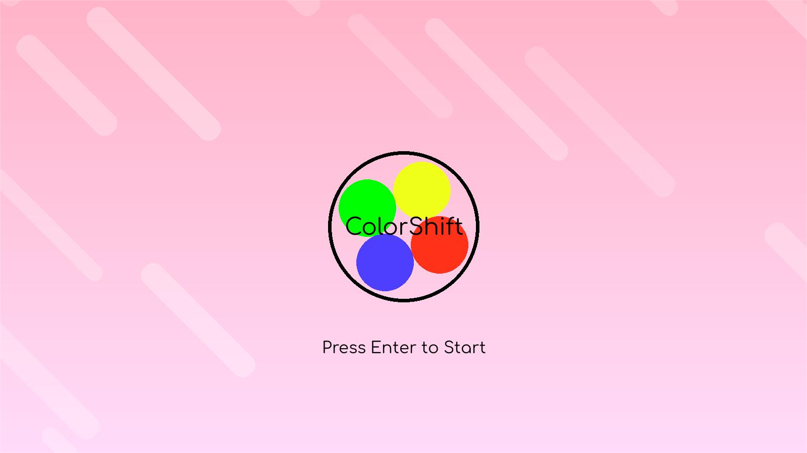
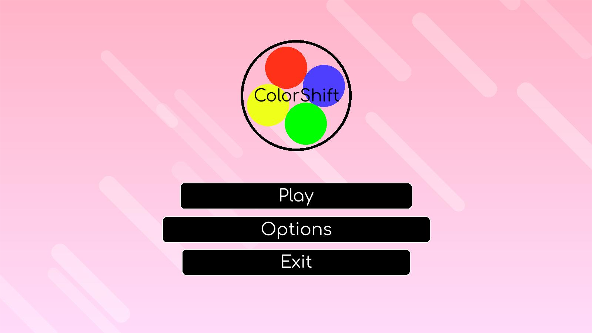
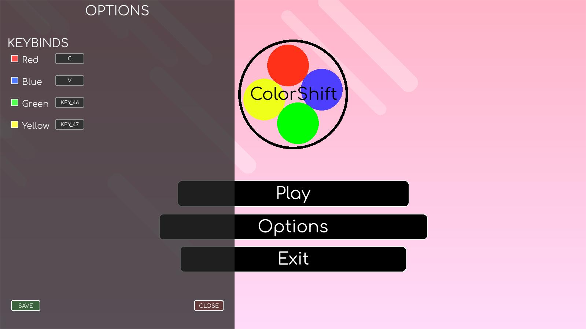

## ColorShift

A Rhythm Game inspired by Osu! My first ever programming project (Not my just first python project, but my first **EVER** project period).

> Do note that since this is my first ever project, the code is **ABSURDLY** bad, like one single "god file" bad. I used a mix of Google, AI, and prayers just for this project.

## Features

- **Automatic Song Parsing** - Basically, just put a song file in the `song_library` folder (with the correct files of course) and it'll display itself in the game.
- **Notespawning** - Notes will appear based on the song file's note metadata (in the song folders .json).
- **Custom Song Creation** - It's not very easy, but it should be fairly straight forward. You can go to the `song_charter` folder and use the song charter there to make the note timings. It's a very primitive way to create songs but I made it so I could brute force the song creation lol.
- **Options Menu** - You can change your keybinds in the options menu (a cool little thing I added just because).

## How to Run

If you want to run the game, run `ColorShift-FullV2(executable).py` in the `v2` folder. 

> **NOTE:** If it doesn't work, the main problem is probably the file paths, so if you really want to give this game a shot, then you should fix the `get_resource_path()` function... I know it's stupid, but I can't be bothered to fix everything in a project I worked on 6 months ago.

### **Requirements:**
- Python 3.10+
- pygame (do `pip install pygame` in the terminal)

## Game Screenshots

### Start Screen

### Menu Screen

### Options

### Song Select Screen

### In Game

## Author

Terrarizer - STEM Student & Developer

